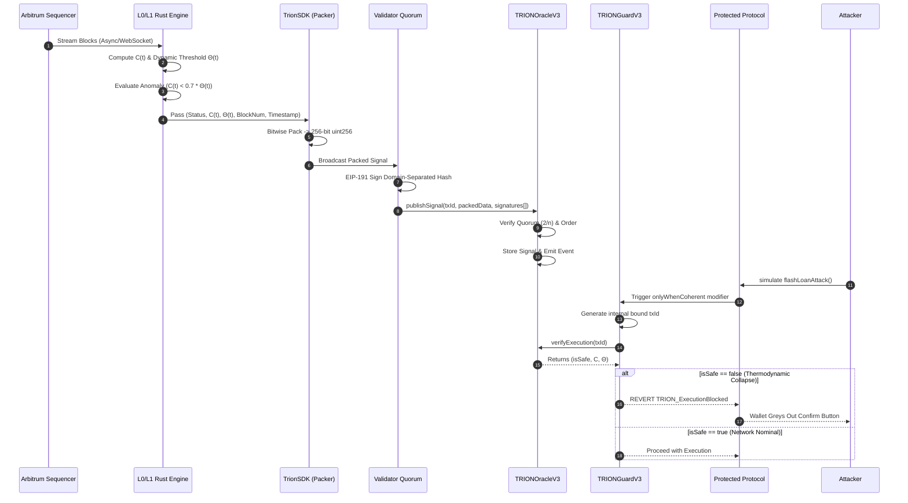

# TRION V3.0 Integration Architecture

This diagram maps the exact flow of thermodynamic truth from the L2 state, into the Rust anomaly detection engine, through the 256-bit SDK packer, signed by the BFT Quorum, and enforced by the on-chain smart contract modifier.

